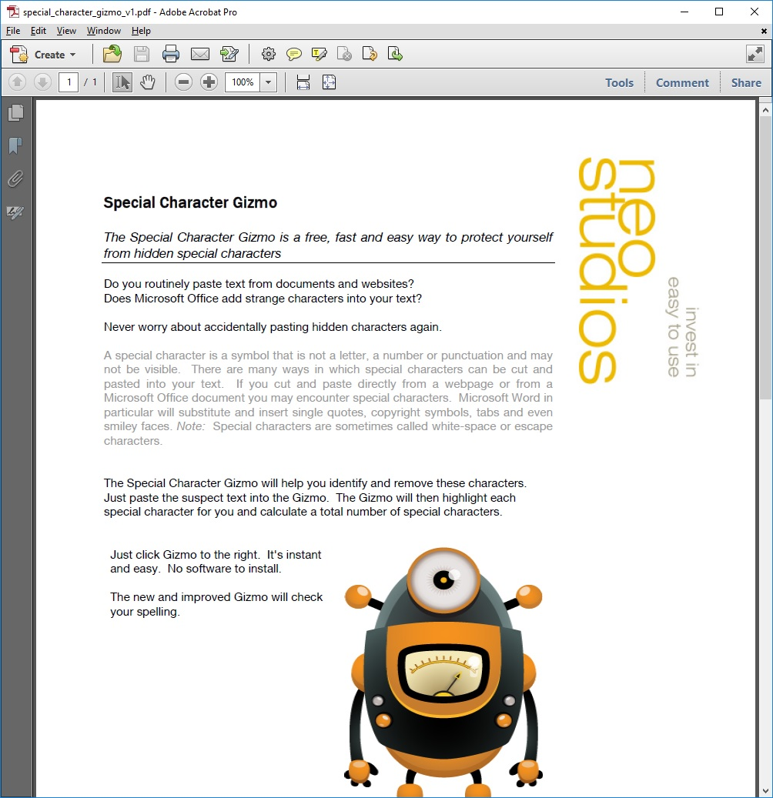

# The [Special Character Gizmo](https://neodigm.github.io/special-character-gizmo//gizmo_special_character_pdf.jpg) is a free, fast and easy way to protect yourself from hidden special characters.

Do you routinely paste text from documents and websites?
Does Microsoft Office add strange characters into your text?
Never worry about accidentally pasting hidden characters again.

A special character is a symbol that is not a letter, a number or punctuation and may
not be visible. There are many ways in which special characters can be cut and
pasted into your text. If you cut and paste directly from a [webpage](https://www.thescottkrause.com/tags/curated/) or from a
Microsoft Office document you may encounter special characters. Microsoft Word in
particular will substitute and insert single quotes, copyright symbols, tabs and even
smiley faces. Note: Special characters are sometimes called white-space or escape
characters.

The Special Character Gizmo will help you identify and remove these characters.
Just paste the suspect text into the Gizmo. The Gizmo will then highlight each
special character for you and calculate a total number of special characters.

Just click Gizmo to the right. It's instant and easy. No software to install.

The new and improved Gizmo will check your spelling (in Adobe Flex [ActionScript 3.0](https://gist.github.com/neodigm/3f74b31c1a12a92c08c3d90ce403998e)).

# Open this file with the Adobe Acrobat reader (not your browser).

---
DataVis 🚀 Micro Frontend 🚀 PWA

#
[Portfolio Blog](https://www.theScottKrause.com) |
[🚀 Résumé](https://www.thescottkrause.com/Arcanus_Scott_C_Krause_2021.pdf) |
[NPM](https://www.npmjs.com/~neodigm) |
[Github](https://github.com/neodigm) |
[LinkedIn](https://www.linkedin.com/in/neodigm55/) |
[Gists](https://gist.github.com/neodigm?direction=asc&sort=created) |
[Salesforce](https://trailblazer.me/id/skrause) |
[Code Pen](https://codepen.io/neodigm24) |
[Machvive](https://www.machvive.com/) |
[Arcanus 55](https://www.arcanus55.com/) |
[Repl](https://repl.it/@neodigm) |
[Twitter](https://twitter.com/neodigm24) |
[Keybase](https://keybase.io/neodigm) |
[Docker](https://hub.docker.com/u/neodigm) |
[W3C](https://www.w3.org/users/123844) |
[InfoSec](https://www.arcanus55.medium.com/offline-vs-cloud-password-managers-51b1fbebe301)
#

  

